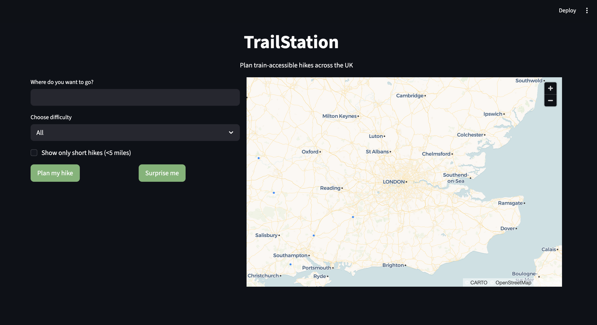
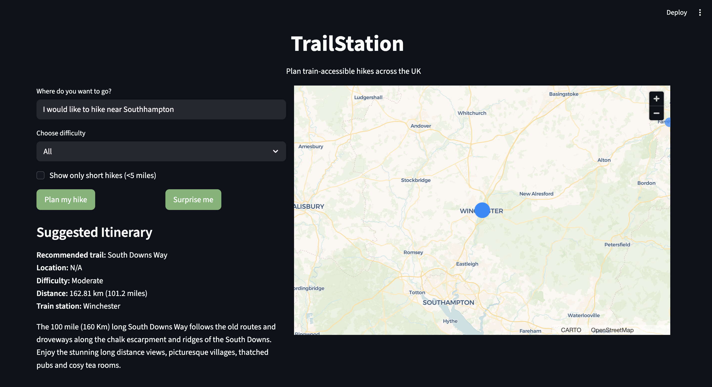
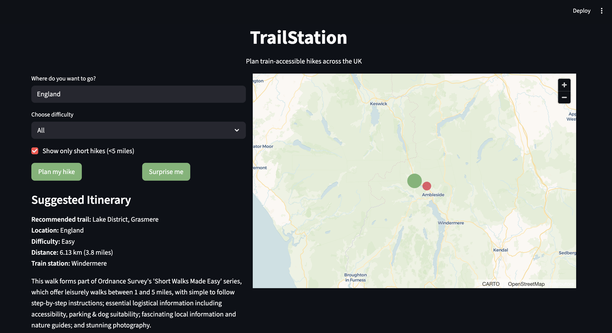
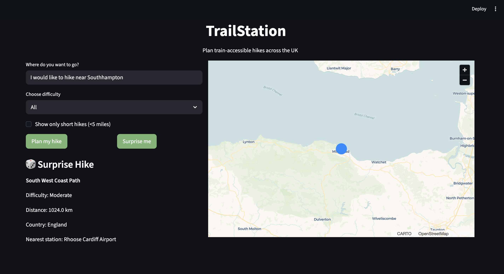

# 🥾 TrackAndTrail

> A locally-run RAG application that connects UK hiking trails to their nearest train station.

## 🎯 Project Purpose

Not everyone has a car — but that should not stop anyone from getting out and
exploring the UK's trails.

TrackAndTrail was built to solve a simple problem: finding hiking trails you can
reach by train. Enter a location, pick a difficulty, and the app suggests a trail
along with the nearest train station to get you there.

The project was also a way to learn how RAG systems work in practice — how to
combine real structured data like train stations and coordinates with unstructured
text like trail descriptions, and make them work together inside one pipeline.
Each trail is linked to its nearest station using the Haversine formula to
calculate the real distance between two coordinates on Earth.

## Demo

[](https://youtu.be/-6zh02UyQmI)

## 🚀 How to Run Locally

### Prerequisites

- Python 3.11+
- [Ollama](https://ollama.com) installed and running locally
- Conda or virtualenv recommended

### 1. Clone the repository

```bash
git clone https://github.com/mAlex28/TrailRouteHike
cd TrailRouteHike
```

### 2. Create and activate conda

```bash
conda create -n trailroutehike-env python=3.11
conda activate trailroutehike-env
```

### 3. Install dependencies and pull rquired Ollama models

```bash
pip install -r requirements.txt
ollama pull llama3
ollama pull mxbai-embed-large
```

### 4. Run Python files

```bash
python src/connect_trails_stations.py
python src/ingest.py
```

### 5. Run the app

```bash
streamlit run app.py
```

Then open http://localhost:8501 in your browser.

## 📸 Screenshots

### Home Screen



### Search Results



### Short Hike Filter



### Surprise Me



## 🧱 Tech Stack

- UI - Streamlit
- Map - Pydeck
- LLM - Llama3 via Ollama
- DB - ChromaDB
- Language - Python

## Project structure

```
trailstation/
│
├── app.py # Streamlit frontend
│
├── src/
│ ├── connect_trails_stations.py # Links trails to nearest station
│ ├── ingest.py # Embeds and stores trails in ChromaDB
│ └── query.py # RAG query pipeline
│
├── data/
│ ├── trails.json # Trail data
│ ├── stations.json # UK train station data
│ └── trails_with_stations.json # Merged dataset
│
├── db/ # ChromaDB persistent storage
├── requirements.txt
└── README.md
```
